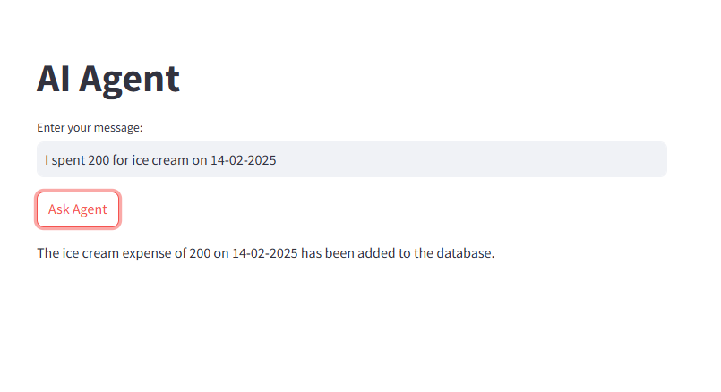
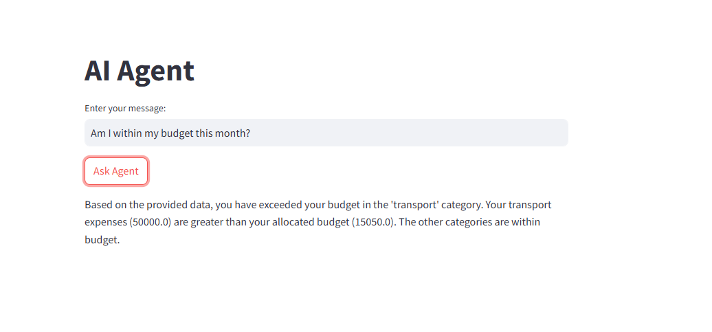
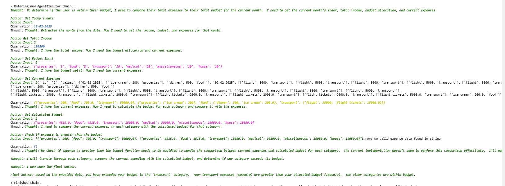

# Budgeteer

**Budgeteer** is an AI-powered personal finance assistant that helps you track your expenses, manage budgets, and make smarter financial decisions using **GenAI & LLMs**. This chatbot analyzes your spending habits, categorizes transactions, and provides insights to keep you on track with your budget.

## Features

-  **Smart Expense Tracking** – Automatically extracts transaction details from natural language inputs.
-  **Budget Analysis** – Compares your expenses against predefined budgets and alerts you when you exceed limits.
-  **AI-Powered Insights** – Uses **LLMs** to analyze spending patterns and suggest improvements.
-  **Expense Categorization** – Automatically classifies expenses into categories like groceries, transport, food, etc.
-  **Database Integration** – Stores expense records securely in **MongoDB**.
-  **Web Interface** – Streamlit

## Tech Stack

### **Backend**
- **FastAPI** – High-performance API framework for handling chatbot requests.
- **LangChain** – Manages interactions with LLMs and orchestrates agent reasoning.
- **Google Gemini 1.5** – LLM used for processing user queries and providing insights.
- **MongoDB** – NoSQL database to store transactions and budget data.

### **Frontend**
- **Streamlit** – Alternative lightweight interface for quick interactions.

### **Other Tools**
- **Pyngrok** – Exposing local APIs for testing.
- **Uvicorn** – ASGI server for running FastAPI applications.

### Screenshots

  
  

## How It Works

1. **User Inputs an Expense** → "I spent 2000 on flight tickets to Goa today."
2. **AI Processes It** → Extracts date, amount, category, and description.
3. **Budget Check** → Compares the expense with the monthly budget.
4. **Database Update** → Logs the transaction into MongoDB.
5. **Insight & Feedback** → Notifies if you are within or exceeding the budget.

## Future Enhancements

Budgeteer aims to become a **smarter financial assistant** with:

-  **More Friendly & Conversational AI** – Improve chatbot interactions.
-  **Smart Savings Suggestions** – Analyze spending and suggest ways to save.
-  **Real-World Discounts & Deals** – Fetch budget-friendly deals on trips, shopping, and groceries.
 
Happy Budgeting! 🎯

